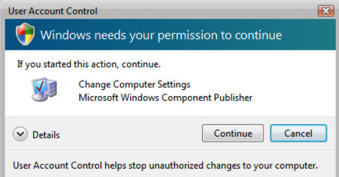

# Electron Dialogs Old Style

About the Library
This library provides a set of dialogs styled to emulate old-school Windows versions, such as:

Windows XP
Windows Vista
Windows 98
Dialogs include:

Confirmation dialogs (e.g., User Account Control).
Error dialogs (e.g., Windows Error messages).
Warning dialogs.
Each dialog comes pre-styled with visuals, sounds, and layout faithful to the original Windows design.

Features
Authentic Appearance: Styles that closely match legacy Windows dialog designs.
Integrated Sounds: Each dialog includes sound effects, such as the Windows Vista ring sound, to replicate the original experience.
Customizable Content: Add more details, icons, and images to the dialogs for a personalized touch.
Usage

This library uses Electron's built-in dialog module and integrates legacy styling through CSS and HTML templates.

Example
Below is an example to display a Vista-style User Account Control dialog:

